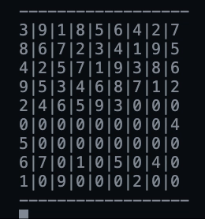

# Sudoku-Solver

Here is a sudoku solver that receives a 2D array and uses 
recursion and backtracking to produce a solution if it exists.

In the main function, solve_sudoku(), you can also choose how fast
the sudoku solver solves using the _speed_ parameter. There is a
puzzles.py that comes with prebuilt 2D lists of sudokus so you can go ahead
and try them out! :)

# You can also view how the backtracking works in live time like this: 

